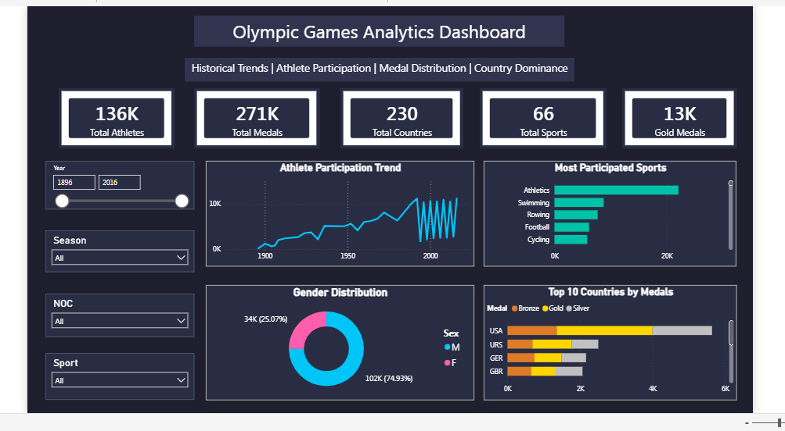

# 🏅 Olympic Games Historical Analysis Dashboard

## 📌 Project Overview

This project analyzes over 120 years of Olympic Games history using Power BI. The dashboard provides interactive insights into athlete participation, medal distribution, sports performance, country-wise achievements, and historical Olympic trends through data visualization and business intelligence techniques.

---

## 🎯 Project Objectives

- Analyze athlete participation across Olympic Games.
- Explore medal distribution by country, sport, and event.
- Identify historical performance trends.
- Visualize participation by gender and season.
- Build an interactive dashboard for data-driven insights.

---

## 🛠️ Tools & Technologies

- Power BI
- Power Query
- DAX
- SQL
- Microsoft Excel

---

## 📊 Dashboard Preview



---

## 📂 Dataset

This project uses the publicly available **Olympic Games Dataset**.

Files included:
- country_definitions.csv
- athlete_events_data_dictionary.csv
- country_definitions_data_dictionary.csv

> **Note:** The full `athlete_events.csv` dataset is not included because it exceeds GitHub's web upload size limit.

---

## 📈 Key Insights

- Analyzed over 120 years of Olympic history.
- Explored medal-winning trends across countries.
- Identified top-performing nations and sports.
- Compared athlete participation by gender and season.
- Visualized Olympic host cities and yearly participation.

---

## 💼 Skills Demonstrated

- Data Cleaning
- Data Transformation
- Data Modeling
- Power Query
- DAX
- Dashboard Development
- Data Visualization
- Business Intelligence
- KPI Reporting

---

## 📁 Repository Structure

```
Olympic-Games-Historical-Analysis/
│
├── Olympic_Games_Dashboard.pbix
├── README.md
├── Data/
├── Documentation/
└── Images/
```
